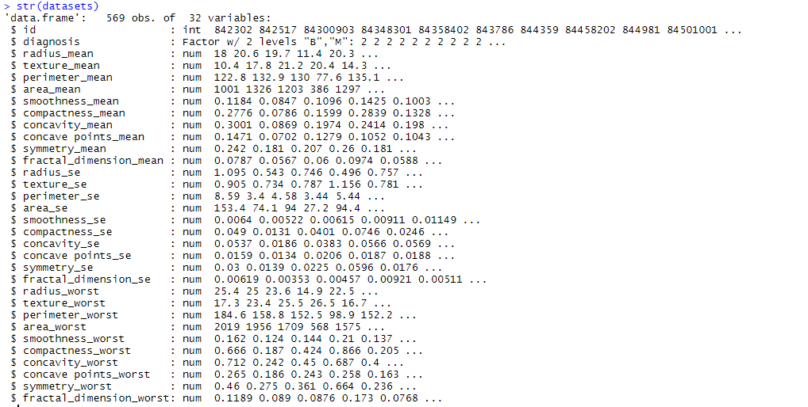
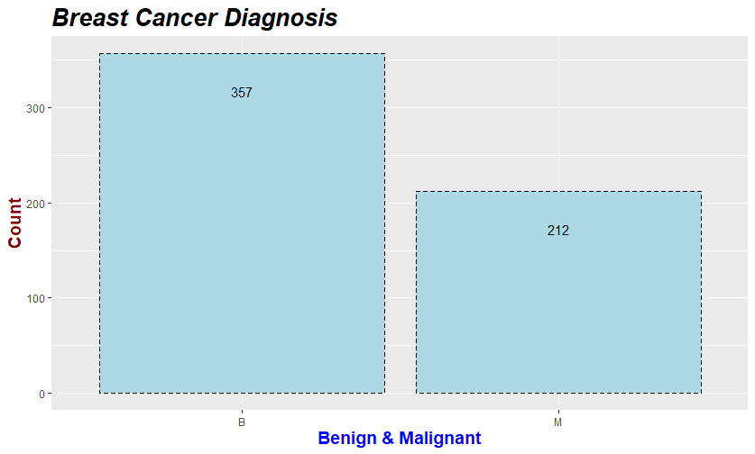
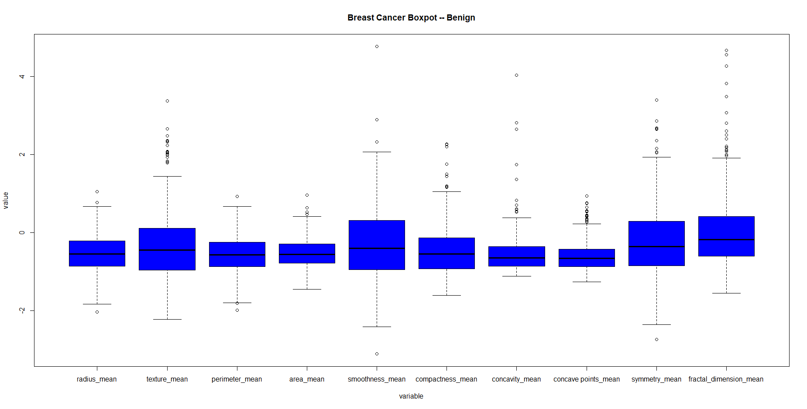
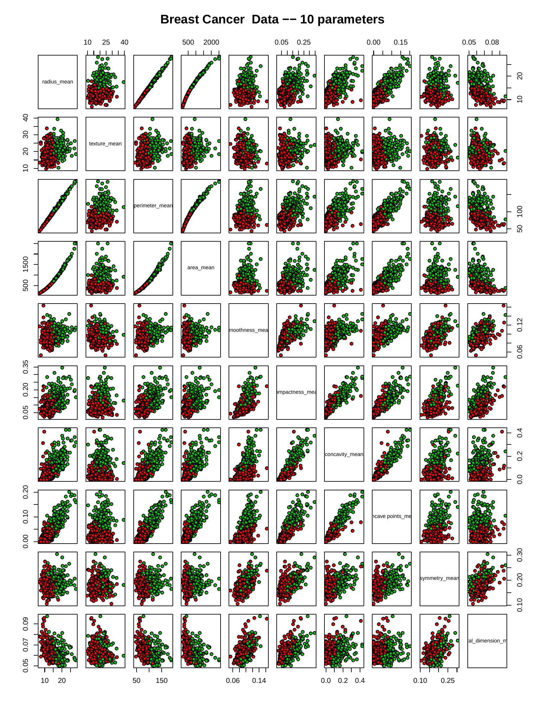
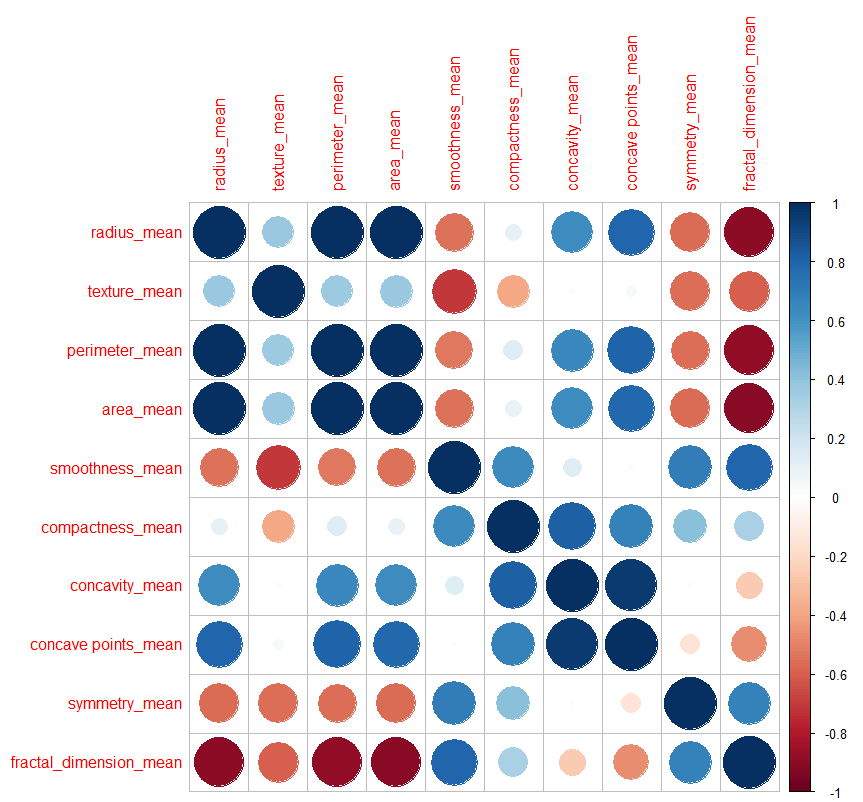
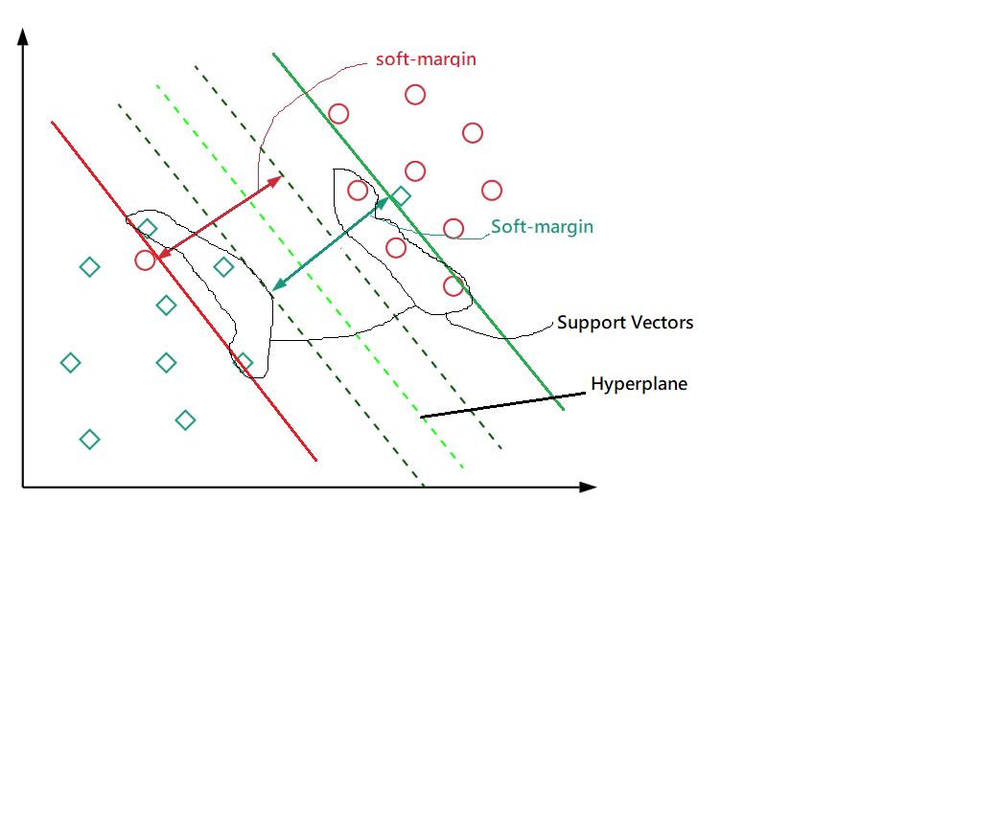
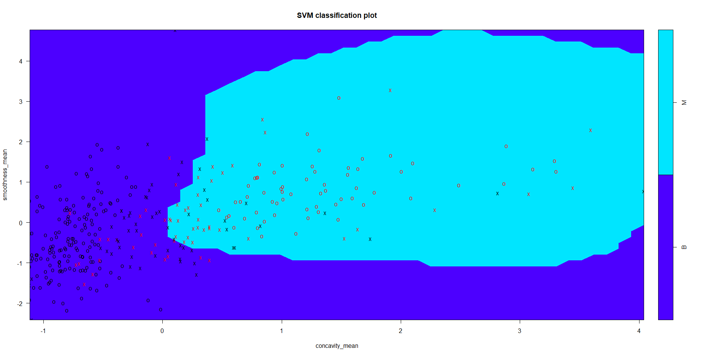
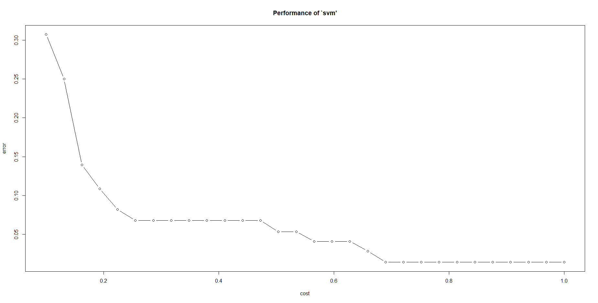
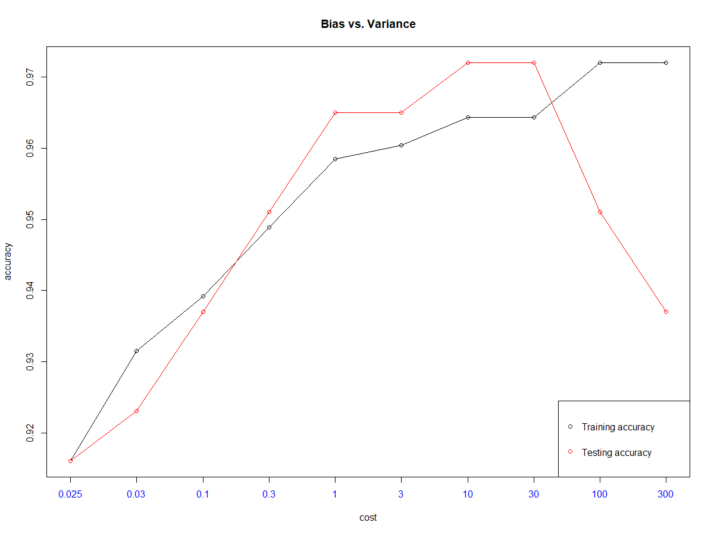
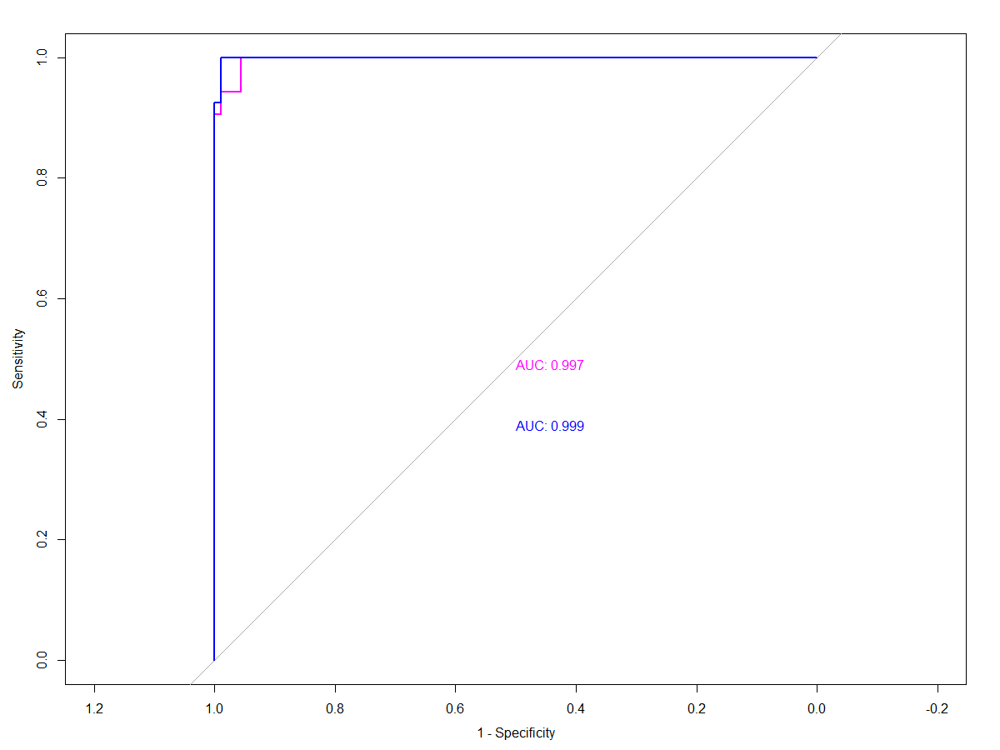

# SupportVectorMachineBCD
Breast Cancer Diagnosis assessment using Support Vector Machine 

## Datasets Description
Dataset is "UCI Machine Learning Repository: Breast Cancer Wisconsin (Diagnostic) Data Set", this dataset has 30 input features consist of 3 groups of parameters and 569 instances to predict diagnosis: benign (B) and malignant (M) which belong to supervised machine learning.

## Dataset Inspection
```Rstudio
# Check and observe the datasets
head(datasets)
tail(datasets)
str(datasets)

# check if datasets has NULL, NA or duplicated data
sum(is.null(datasets))
sum(is.na(datasets))
datasets[duplicated(datasets)]
```



## Data Exploratory and Inferential
``` R
# hist plot - The number of Breast Cancer Diagnosis
ggplot(datasets) + aes(datasets$diagnosis) + geom_bar(color="black", fill="lightblue", linetype="dashed") + ggtitle("Breast Cancer Diagnosis") +
  xlab("Benign & Malignant") + ylab("Count") + geom_text(stat='count', aes(label=..count..), vjust=4) + theme(
    plot.title = element_text(color="Black", size=20, face="bold.italic"),
    axis.title.x = element_text(color="blue", size=14, face="bold"),
    axis.title.y = element_text(color="#800000", size=14, face="bold")
  )
```


``` R
# boxplot - A boxplot with normalize Benign features
boxplot(value ~ variable, data=long.B, main = "Breast Cancer Boxpot -- Benign", col="blue")
```


``` R
# scatterplots - A matrix of scatterplots with breast cancer diagnosis distribution
pairs(datasets[,3:12], main = "Breast Cancer  Data -- 10 parameters", pch = 21, bg = c("red", "green3")[unclass(datasets$diagnosis)])
```


``` R
# The correlation plot of 10 feature
datasets.matrix <- data.matrix(datasets[,3:12])
datasets.cor = cor(datasets.matrix , method = c("spearman"))
datasets.rcorr = rcorr(as.matrix(datasets.cor))
corrplot(datasets.rcorr$r)
```


## Support Vector Machine
In machine learning, support vector machine (SVM) can be the most popular and accurate classification algorithm. In 1995 introduced by Corinna Cortes and Vladimir Vapnik, SVM is a binary classification method, and the main concept is mapped a non-linearly high-dimensional hyperplane between support vectors, in other words, this frontier tries to feature a separate space that widest margin between two sets of data points of any class. Figure below is a 2-dimensional Support Vector Machine diagram, and the green line is the hyperplane, the blue line is margin, and the black circles are data wich call support vectors. The basic concept is to identify the best hyperplane location, which can maximize the margin between the different class of data, which means maximal margin classifier. There are various studies and interpretation of the SVM algorithm.



In the real case scenario, part of data will always out of the range or the best classification line and reach to the other class area as shown in figure above, and the linear classification cannot separate it. Therefore, the soft-margin SVM was introduced by Vapnik at 1995; this allows the miss-classification such that it can remain the best hyperplane, any new data can still be classified with the maximum margin. The soft-margin value can determine by the cross-validation method, and those data within the soft-margin are support vectors, while the numbers of allow miss-classification named cost and it can be the most critical parameter in SVM. At last, if the data is 1-dimensional, there is no hyperplane, and the classifier is a single point when the data are with 2-dimensional, then the support vector classifier is a line. Furthermore, the 3-dimensional data's support vector classifier will be a plane.

## SVM implementation
``` R
## sigmoid Kernel
svm.model.sig.t <- svm(diagnosis~., data = datasets.train[,-1], kernel = "sigmoid")
confusionMatrix(datasets.train$diagnosis, predict(svm.model.sig.t))
svm.model.sig.plot.t <- svm(diagnosis~ smoothness_mean + concavity_mean, data = datasets.train[,-1], kernel = "sigmoid")
plot(svm.model.sig.plot.t, datasets.train, smoothness_mean ~ concavity_mean,
     color.palette = topo.colors)
pred.svm.model.sig.t <- predict(svm.model.sig.t, datasets.test[,c(-1,-2)])
confusionMatrix(datasets.test$diagnosis, pred.svm.model.sig.t)
```
Different kernel functions are used to train the in different SVM model, and the parameters are set to default values. All methods are first training by the training data and then measure the accuracy by both training dataset and testing dataset, table below is the summary of the accuracy, sensitivity and specificity.

|  |  | Training dataset |  |  | Testing datasets |  |
| --- | --- | --- | --- | --- | --- | --- |
| Methodology | Accuracy | Sensitivity | Specificity | Accuracy | Sensitivity | Specificity |
| SVM - LN | 98.81 | 98.18 | 100 | 98.2 | 98.57 | 97.56 |
| SVM - Radial | 98.81 | 98.18 | 100 | 98.2 | 98.57 | 97.56 |
| SVM - Polynomial | 98.81 | 98.18 | 100 | 98.2 | 98.57 | 97.56 |
| SVM - Sigmoid | 98.81 | 98.18 | 100 | 98.2 | 98.57 | 97.56 |

 An example showing the ** SVM-Radial hyperplane, x is support vectors and red/black colour belong to M/B **
 

## SVM Exhaustive Evaluation
The initial evaluation is showing that SVM-radial can be a suitable kernel function in breast cancer dataset, the more profound analysis of cross-validation force on this method. As discussed, there are several vital parameters can sensitive on SVM's performance, such as cost, gamma and epsilon (although this can mainly effect on SVR, it is valuable to verify and count on evaluation.). On the other hand, the initial can be abnormally good due to the accuracy and performance, and the random datasets regenerate in this section. 

Cost parameter analysis
``` R
## Cross validation -----------------------------

# Create svm model
svm.model.rad <- svm(diagnosis~., data = datasets.train[,-1], kernel = "radial")
confusionMatrix(datasets.train$diagnosis, predict(svm.model.rad))
pred.svm.rad.test <- predict(svm.model.rad, datasets.test[,c(-1,-2)])
confusionMatrix(datasets.test$diagnosis, pred.svm.rad.test)


svm.tune.rad.cost <- tune(svm, diagnosis ~., data = datasets.cvr[,-1], kernel="radial",
                          ranges = list(cost = seq(0.1, 1, length=30)))
plot(svm.tune.rad.cost)
```
 
 
 ``` R
 # Plot the bias vs variance
plot(cva,type = "o", xaxt='n',yaxt='n',ann=FALSE)
par(new=TRUE)
plot(cvb,type = "o",col="red", xaxt='n', xlab = "cost", ylab = "accuracy", main = "Bias vs. Variance")
legend("bottomright", pch=1, col=c("black", "red"), legend = c("Training accuracy", "Testing accuracy"))
axis(1, 1:10, c("0.025","0.03","0.1","0.3","1","3","10","30","100","300"), col.axis = "blue")
```


## Performance analysis
performance evaluation is an indicator that is detected when classifying problems. The classification ability can be evaluated by the Receiver Operating Characteristics (ROC) curve and the Area Under the Curve (AUC) value, the higher the value, the higher the classification ability, for instance, the AUC is 0.5 meaning that cannot work as classification function. 
``` R
## plot ROC curve - Receiver Operating Characteristic (ROC)
#install.packages("pROC")
library(pROC)
pred.svm.rad.test <- predict(svm.model.rad, datasets.test[,c(-1,-2)], decision.values=TRUE)
dv <- attributes(pred.svm.rad.test)$decision.values
plot.roc((as.numeric(datasets.test$diagnosis)-1), dv, xlab = "1 - Specificity", print.auc=TRUE, col="Magenta")
#par(new=TRUE)
pred.svm.rad.tune.test <- predict(svm.model.rad.tune, datasets.test[,c(-1,-2)], decision.values=TRUE)
dv.tune <- attributes(pred.svm.rad.tune.test)$decision.values
plot.roc((as.numeric(datasets.test$diagnosis)-1), dv.tune, xlab = "1 - Specificity", print.auc=TRUE, col="blue",print.auc.y = .4, add = TRUE)
```

 
## Brief Summary
In summary, the first step is using multiple kernel functions to compare and examine their characteristics to select the goodness fit method for further cross-validation and prediction then reach the final accuracy up to 97.2%, and this can be a reliable and predictable Breast Cancer Machine Learning model. Based on the analysis and comparison show that SVM-Radial is probably the most accurate model. Besides, the study was further evaluating the Decision Tree and observed the limitations on data analysis, while Random Forest can effectively generate multiple sets of Decision Tree to overcome this disadvantage. Nevertheless, both SVM-Radial and Random Forest algorithms require significant computing power or time consuming to achieve accurate prediction.
